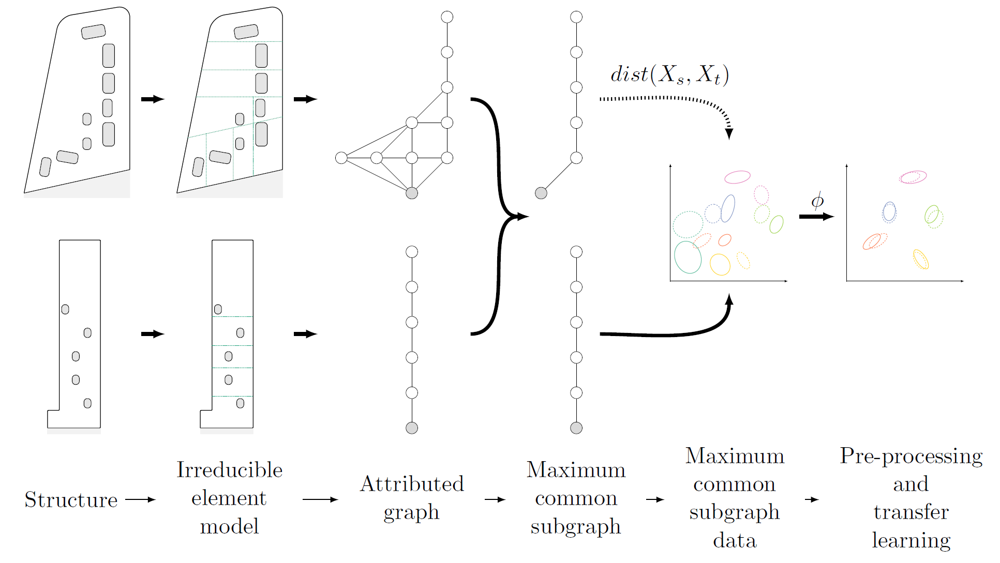
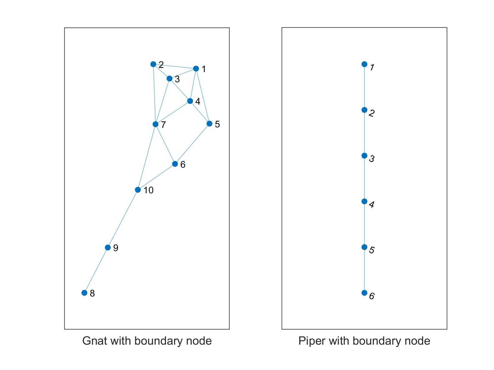
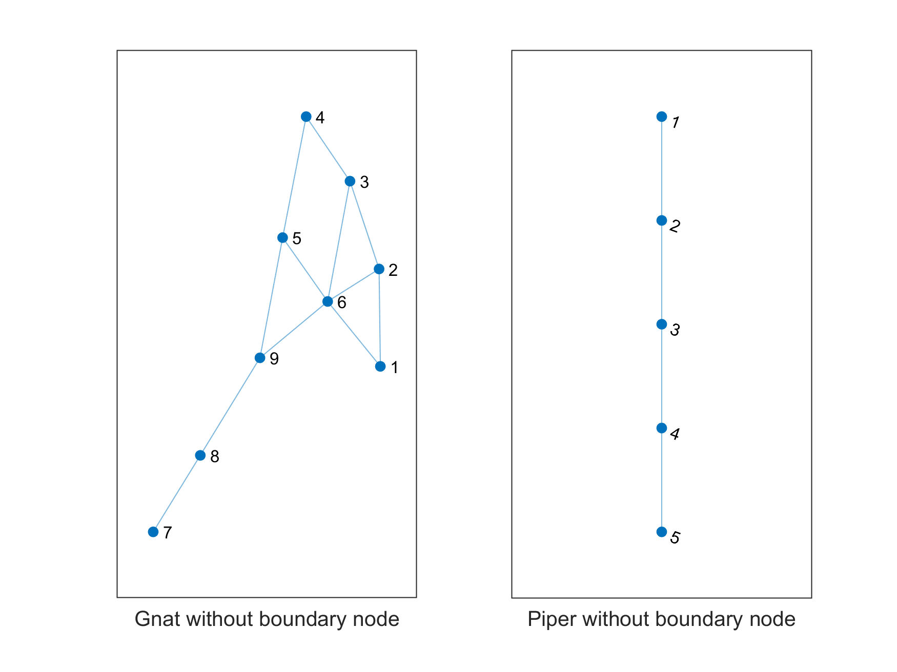
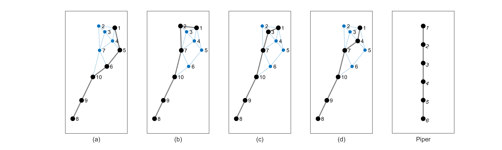
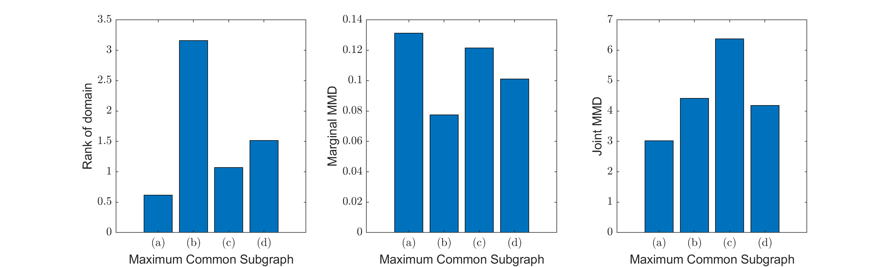
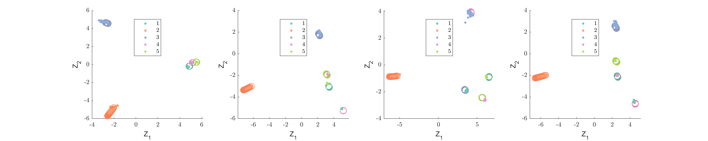
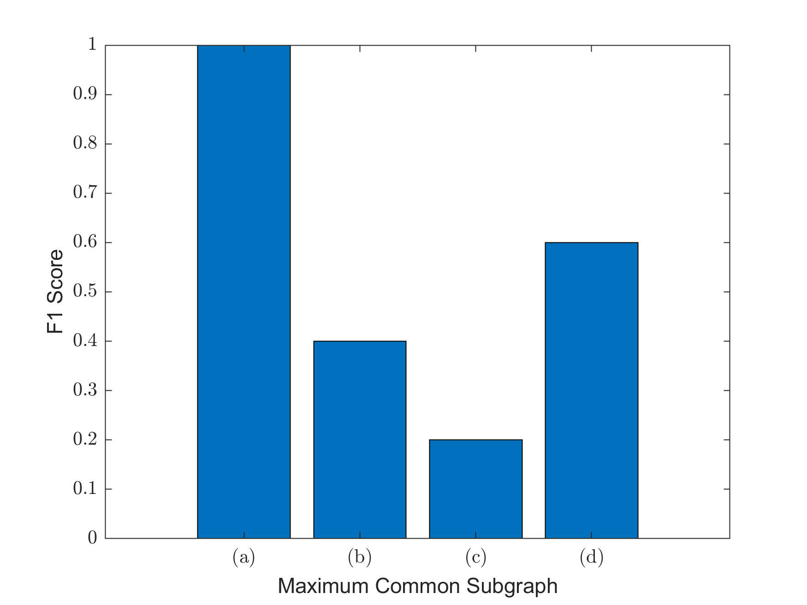

# Demo for [A population-based SHM methodology for heterogeneous structures: Transferring damage localisation knowledge between different aircraft wings](https://doi.org/10.1016/j.ymssp.2022.108918)

---

* Two demos demonstrating the graphs and transfer learning performed in as part of a [population-based SHM method](https://doi.org/10.1016/j.ymssp.2022.108918) for heterogenous structures.
* The demo script [gnat_piper_graph_visualisation.m](https://github.com/pagard/EngineeringTransferLearning/blob/main/demos/gnat_piper_graph_visualisation.m) creates the graphs from the paper
* The demo script [gnat_piper_demo.m](https://github.com/pagard/EngineeringTransferLearning/blob/main/demos/gnat_piper_demo.m) calculates the distance metrics (ROD, marginal and joint MMDs) for the four maximum common subgraphs and the performs balanced domain adaptation.

---

## A brief overview of the population-based structural health monitoring methodology

**Structural Similarity**
The methodology takes a population of structures and forms irreducible element models that seek to capture the main structural processes required for performing knowledge transfer. These irreduicble element models can be converted to attributed graphs, and graph matching processes can identify how similar the two structures are and where they are similar through the identified subgraphs.

**Data similarity**
Distance metrics can be used to assess how similar the data spaces are between any memebers of the population. The 'closest' data spaces are expected to reduce the change of negative transfer.

**Transfer learning**
Once a potential candidate has been selected from graph matching and data similarities, transfer learning can be performed. Transfer learning, in the form of domain adapation, seeks to find a mapping that harmonises the source and target datasets. The aim of these approaches are that in the mapped space, a classifier built on the (labelled )source domain will generalise to the (unlabelled) target domain.

Below is a diagram that graphically describes this process.

---

## Graph demo script

A demo script [gnat_piper_graph_visualisation.m](https://github.com/pagard/EngineeringTransferLearning/blob/main/demos/gnat_piper_graph_visualisation.m) is provided that creates the attributed graphs from the paper. The script also creates categories 'Random', 'Cat. 1', 'Cat. 2' and Maximum Common Subgraph ('MCS') from section 3. Once you run the script you will get the three figure below, and a figure that loops through all connect subgraphs.

Below is a visualisation of the subgraph *with* boundary nodes. (Note: that the boundary nodes are labelled '1' in the figure, and all other nodes are +1 to their values in the paper). Valid paths in this graph denote 'Cat. 2' in the paper.

Below is a visualisation of the subgraph *without* boundary nodes. (Note: all node labels are the same as those in the paper). Valid paths in this graph denote 'Cat. 1' in the paper.

Below is a visualisation of the maximum common subgraphs from the paper (identified using the modified BK algorithm).

## Transfer demo script

A demo script [gnat_piper_demo.m](https://github.com/pagard/EngineeringTransferLearning/blob/main/demos/gnat_piper_demo.m) is provided that calculates the three distance metrics (rank of domain, marginal maximum mean discreapancy and joint maximum mean discreapcny) for the four candidate maximum common subgraphs from the paper.

The script then performs balanced distribution adapation (BDA) on the four candidate maximum common subgraphs, where the below figure shows the transfer component mappings (labelled using the true labels), where the source (.) and target (o) datasets now lie on top of each other, but misclassification has occured for subgraphs (b), (c) and (d).

Finally, the last figure shows a comparison of the target testing F1 scores for the four subgraphs, showing that (a) produces an F1 score of 1 and was closet on two out of the three distance metrics. 

