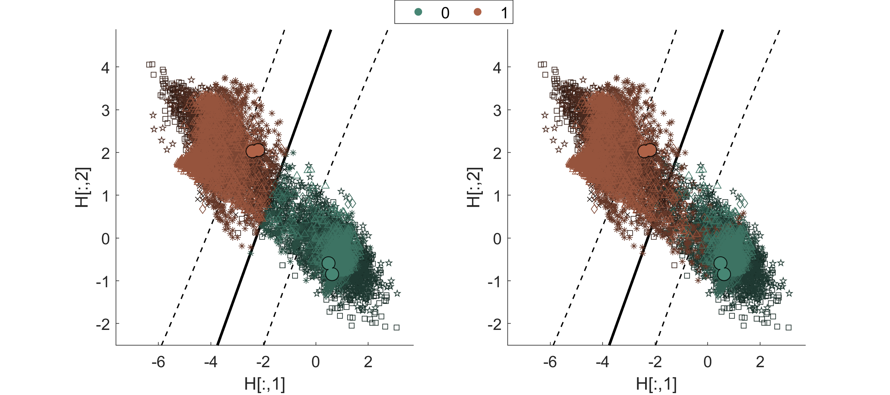
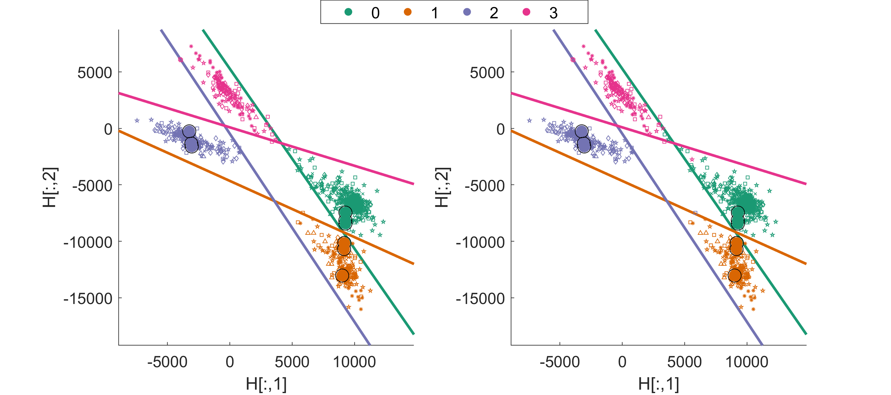
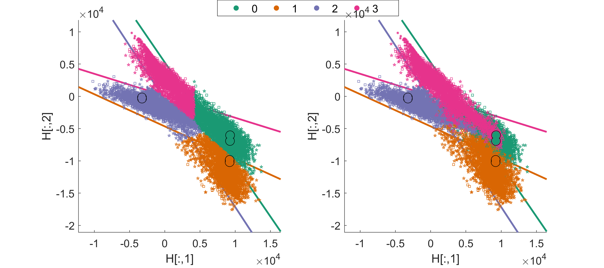

# KBTL Demo for [On the application of kernelised Bayesian transfer learning to population-based structural health monitoring](https://doi.org/10.1016/j.ymssp.2021.108519) [Open Access]()

---

* This code implements a demonstration of kernelised Bayesian transfer learning (KBTL).
* This code performs KBTL on natural frequencies from numerical and experimental shear buildings with different numbers of storeys: there is a demo for [binary](https://github.com/pagard/EngineeringTransferLearning/blob/main/demos/kbtl_demo_binary.m) and [multi-class](https://github.com/pagard/EngineeringTransferLearning/blob/main/demos/kbtl_demo_multiclass.m) classification (section 3.1 of the [paper](https://doi.org/10.1016/j.ymssp.2021.108519)).

---

## A brief overview of heterogeneous transfer learning and kernelised Bayesian transfer learning

**Heterogeneous transfer learning** seeks to find a mapping between feature spaces of different dimensions onto a shared latent subspace. In this subspace label information can be transferred through one classifier.

**KBTL** Kernelised Bayesian trasnfer learning (KBTL) infers a linear projection for each domain onto the latent subspace, and then infers a discriminative classifier in this latent space (in the multi-class setting in a one-vs-all manner). The method is similar in design to a relevance vector machine, where sparsity is induced in the classifier and linear projections through sparse priors. Inference is performed in a Bayesian manner using variational inference. For more details, see the [paper](https://doi.org/10.1016/j.ymssp.2021.108519) or the original algorithm [paper](https://users.ics.aalto.fi/gonen/files/gonen_aaai14_paper.pdf).

An overview of the approach is shown below:

---

## Demo script

There are two demo scripts for KBTL, [kbtl_demo_binary.m](https://github.com/pagard/EngineeringTransferLearning/blob/main/demos/kbtl_demo_binary.m) and [kbtl_demo_multiclass.m](https://github.com/pagard/EngineeringTransferLearning/blob/main/demos/kbtl_demo_multiclass.m), demonstrating binary and multi-class classificaiton. *Note*, results may differ slighlty from the paper due to different random seeds.

### Binary

The binary case study shows KBTL being performed on a population of seven structures, the first six are numerical and the seventh is experimental (section 3.1.1 of the [paper](https://doi.org/10.1016/j.ymssp.2021.108519)). The features are the number of bending natural frequencies associated with each shear structure (i.e. each domain has a different dimensioned feature space).

Once run you will see two figures - both show the inferred latent space ($H$) - the first figure is the training data (predicted labels left and true labels right), and the second the testing data (predicted labels left and true labels right), where both include the discriminative classifier.

### Multi-class

The multi-class case study shows KBTL being performed on the same population of seven structures, the first six are numerical and the seventh is experimental (section 3.1.2 of the [paper](https://doi.org/10.1016/j.ymssp.2021.108519)). The features are the number of bending natural frequencies associated with each shear structure (i.e. each domain has a different dimensioned feature space).

Once run you will see two figures - both show the inferred latent space ($H$) - the first figure is the training data (predicted labels left and true labels right), and the second the testing data (predicted labels left and true labels right), where both include the discriminative classifiers (trained in a one-vs-all manner).

