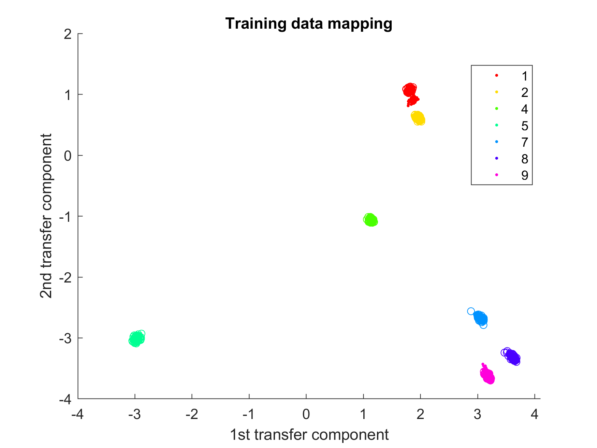
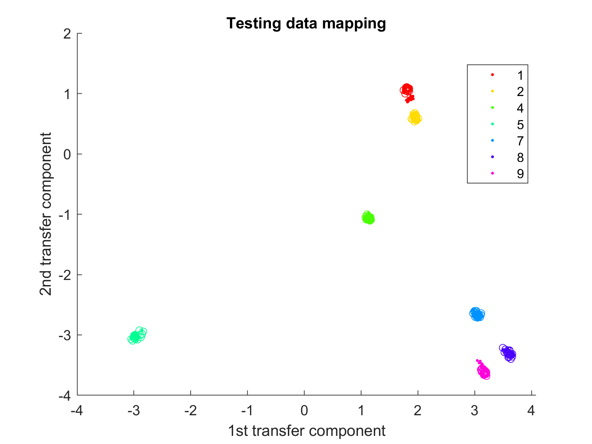

# M-JDA Demo for [Overcoming the problem of repair in structural health monitoring: Metric-informed transfer learning](https://www.sciencedirect.com/science/article/pii/S0022460X21003175)

---

* This code implements a demonstration of metric-infored joint distribution adaptation (M-JDA) with the specific application of changes in distribution due to structural repair scenarios in structural health monitoring
* The code performs domain adaptation on transmissibilities from a [Gnat aircraft](https://doi.org/10.1006/jsvi.2002.5169) (section 6.1 of the [paper](https://www.sciencedirect.com/science/article/pii/S0022460X21003175))

---

## A brief overview of domain adaptation and M-JDA

**Domain adaptation** seeks to *harmonise* datasets such that label information from a *source* dataset can be applied to an unlabelled (or partially labelled) *target* dataset.

**M-JDA** seeks to harmonise a source and target dataset by inferring a mapping that minimises the (maximum mean discrepancy) distance between the source and target joint distributions. To increase the efficiency of the approach, the joint distributions are approximated by minimises the distance between the marginal and class conditional distribution. The class conditional is easily obtained for the labelled source domain, but psuedo-labels are required for the unlabelled target domain. M-JDA uses Mahalanobis distances from the source classes to the target in order to obtain initial estimates of these psuedo-labels. For more details, see the [paper](https://www.sciencedirect.com/science/article/pii/S0022460X21003175).

---

## Demo script

A demo script [mjda_demo_gnat.m](https://github.com/pagard/EngineeringTransferLearning/blob/main/demos/mjda_demo_gnat.m) is provided with pre-processed data from the Gnat repair problem in section 6.1 of the [paper](https://www.sciencedirect.com/science/article/pii/S0022460X21003175). Note, results may differ slighlty from the paper due to different random seeds in the training-testing data split.

Once run you will see two figures - both show the inferred latent space from the M-JDA algorithm, the first figure is the training data, and the second the testing data.

The mapping generalises well and has harmonised the source (.) and target (o) datasets (i.e. the datasets lie on top of each other). A kNN classifier trained on the source data in the latent space classifies the target data in the latent space with an accuracy of 100%.